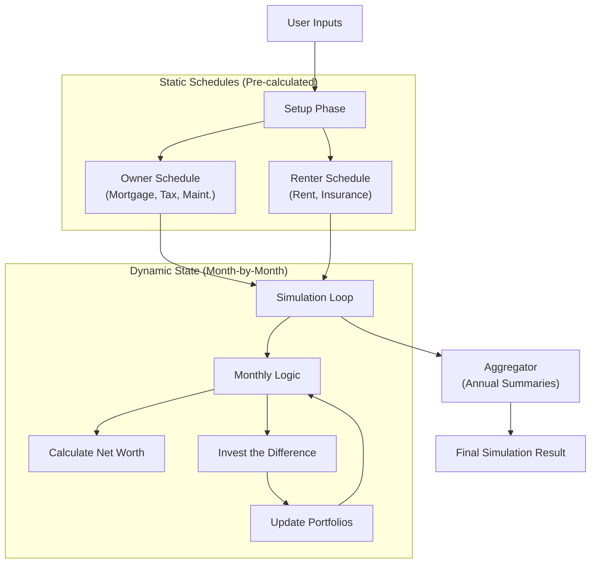

# Simulation Engine Architecture

This document outlines the architecture of the core financial simulation engine located in `src/lib/engine`.

## Core Philosophy: Static Schedules vs. Dynamic State

The engine is built on the principle of separating **Deterministic Costs** (what we know will happen) from **Dynamic Accumulation** (how wealth grows based on those costs).

This separation allows for easier testing and cleaner logic.

### High-Level Data Flow



## Module Breakdown

The engine is refactored into modular components, each with a specific responsibility.

### 1. `simulation.ts` (The Orchestrator)
**Role:** The conductor. It doesn't know math; it knows *time*.
- Initializes the simulation.
- Loops through every month (0 to `years * 12`).
- Passes state between the **Schedules** and the **Monthly Logic**.
- Collects results.

### 2. `owner.ts` & `renter.ts` (The Static Schedules)
**Role:** Calculate the "Bill" for each month.
These modules generate arrays of data representing the fixed costs of housing.

**Key Logic in `owner.ts`:**
- **Mortgage Amortization**: Splits monthly payments into Principal vs. Interest.
- **Prop 13**: Handles property tax caps (if enabled).
- **Maintenance**: Calculates maintenance costs.

**Key Logic in `renter.ts`:**
- **Rent Inflation**: Compounds rent annually.
- **Insurance**: Calculates renter's insurance.

### 3. `monthly-logic.ts` (The Brain)
**Role:** The decision maker. It takes the "Bills" and the "Wallet" and decides what happens next.

**Key Responsibilities:**
- **"Invest the Difference"**:
    1. Calculates `Owner Total Outflow` vs. `Renter Total Outflow`.
    2. Determines who saved money this month.
    3. Adds the savings to that person's investment portfolio (adjusted by `discipline` factor).
- **Portfolio Growth**: Compounds investment returns.
- **Net Worth Calculation**:
    - Owner = Home Value + Investments - Remaining Mortgage
    - Renter = Investments

### 4. `aggregator.ts` (The Accountant)
**Role:** Summarizes granular monthly data into readable annual reports.
- Sums up cash flows for charts.
- Tracks "Cash on Cash" returns.

## Data Structures (ASCII)

### The `OwnerMonthlyState` (Static)
Generated by `owner.ts` before the loop starts.
```text
[
  { 
    month: 1, 
    interestPayment: $3500, 
    principalPayment: $500, 
    propertyTax: $850, 
    maintenance: $700,
    ...
  },
  {
    month: 2, 
    interestPayment: $3498, 
    principalPayment: $502, 
    ...
  }
]
```

### The `MonthlyCashFlow` (Dynamic Result)
Generated by `monthly-logic.ts` during the loop.
```text
{
  year: 1,
  month: 1,
  ownerNetWorth: $205,000,  // (Equity + Investments)
  renterNetWorth: $200,000, // (Investments)
  ownerTotalOutflow: $5,550,
  renterTotalOutflow: $4,200,
  ...
}
```

## Adding New Logic

- **Want to change how Mortgage works?** (e.g., ARM loans) -> Edit `owner.ts`.
- **Want to change Tax Deductions?** -> Edit `monthly-logic.ts` (this is where income and outflows meet).
- **Want to change Rent Control?** -> Edit `renter.ts`.

```